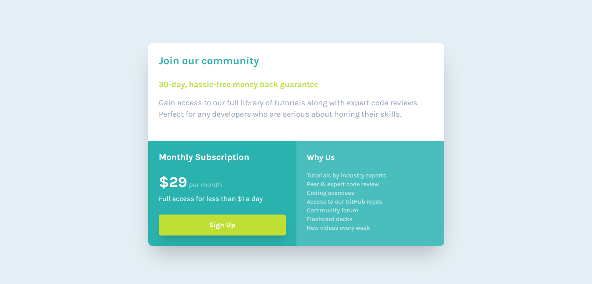

# Proyecto Single Price Grid Component - Desafío de Frontend Mentor para Novatos 😊

## Introducción

Este proyecto consiste en la construcción de un componente de precio único (Single Price Grid Component), basado en un desafío de Frontend Mentor. El objetivo principal fue recrear el diseño proporcionado utilizando **HTML** y **Tailwind CSS** para el estilizado, aprovechando la potencia y rapidez que ofrece este framework para CSS.

## Mi experiencia desarrollando el proyecto

Para llevar a cabo este desafío, opté por utilizar HTML semántico para estructurar el contenido de forma clara y accesible, y Tailwind CSS para el diseño y la maquetación responsiva. Esta combinación me permitió:

-   Crear una estructura limpia y fácil de mantener.
-   Implementar estilos de forma rápida y eficiente sin escribir CSS personalizado extenso.
-   Adaptar el diseño para diferentes tamaños de pantalla utilizando las clases responsivas que Tailwind ofrece.
-   Añadir efectos interactivos, como estados hover, para mejorar la experiencia de usuario.

Durante el desarrollo, me enfoqué en mantener el código organizado y reutilizable, aprovechando las utilidades de Tailwind para manejar márgenes, paddings, tipografías y colores según la guía de estilos del desafío.

## Características principales

-   Diseño responsivo que se adapta perfectamente a dispositivos móviles y escritorio.
-   Uso de estados hover para mejorar la experiencia de usuario en el botón de "Sign Up".
-   Implementación fiel al diseño original, respetando paleta de colores, tipografía y distribución.
-   Código limpio y bien estructurado para facilitar futuras modificaciones o ampliaciones.

## Recursos y referencias

-   Documentación oficial de [Tailwind CSS](https://tailwindcss.com/) para la implementación de estilos.
-   Herramientas de desarrollo para probar y ajustar la responsividad.
-   Diseño original y assets proporcionados por Frontend Mentor.

---

## Vista final del proyecto

---

**¡Gracias por visitar este proyecto!**  
Si tienes alguna pregunta o comentario, no dudes en contactarme. 🚀
